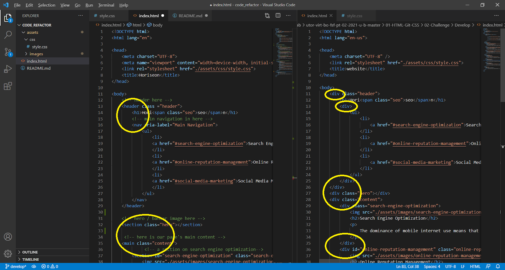
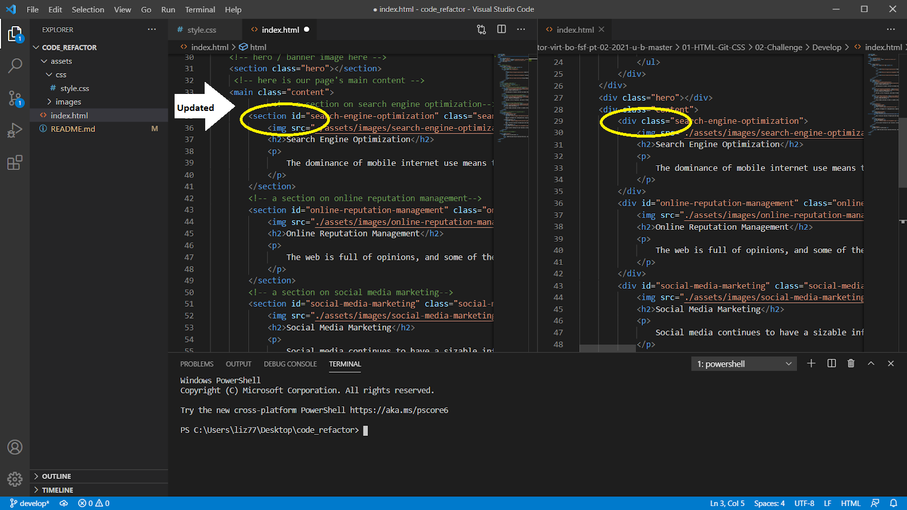
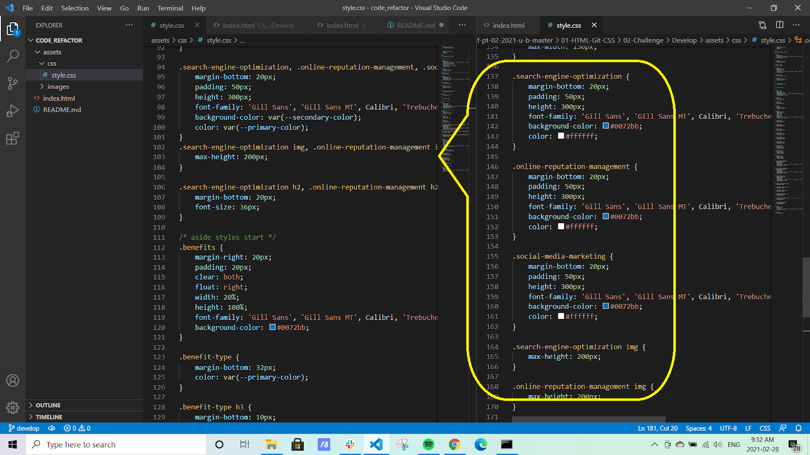
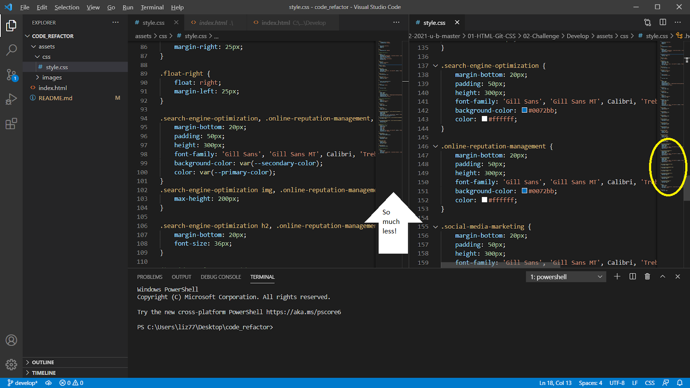

# Horiseon Code Refactor

## [The Repository](https://oakesec.github.io/code_refactor/)

## Description

###### I was tasked with refactoring (updating) the existing codebase of Horiseon's webpage to meet accessibilty standards, so that their site would be optimized by search engines.  This includes the use of more descriptive (semantic) elements, ensuring the HTML structure follows a logical pattern and headings are in sequential order, there are alternative attributes (descriptions) for images,  and a concise, descriptive title.

###### It's also good practice that I follow the Scout Rule (leave the code cleaner than I found it).

## Task List
* [x] Ensure that all links are functioning correctly
* [x] Clean up the CSS to make it more efficient, organizing them to follow the semantic structure of the HTML elements, and;
* [x] Include comments before each element or section of the page
* [x] Update with semantic HTML elements
* [x] Image elements updated with accessible alt attributes
* [x] The structure of the HTML elements follow a logical structure independent of styling and positioning, and heading attributes fall in sequential order
* [x] The title element is concise and descriptive

## Some Exmaples of Requested Improvements

##### Updating to Semantic Elements

##### Increased Contrast for Accessibility

##### Adding Focus to Navigation With Hover

## Some Examples of Code Cleanup 

##### Fixing the Broken Link

##### Consolidating Duplicate Code

## Resources:
* https://developer.mozilla.org/en-US/docs/Web/CSS/text-transform
* http://wiki.c2.com/?DontRepeatYourself
* https://developer.mozilla.org/en-US/docs/Web/Guide/HTML/Using_HTML_sections_and_outlines#problems_solved_by_html5
* https://stackoverflow.com/questions/11091081/what-is-the-appropriate-html-5-element-for-a-hero-unit-showcase
* https://stackoverflow.com/questions/56803764/what-is-the-main-tag-in-html5-how-does-it-differ-from-body-tag/56806665#:~:text=It%20describes%20content%20of%20the,main%20tag%20in%20the%20page.
* https://developer.mozilla.org/en-US/docs/Glossary/Semantics
* https://www.w3.org/WAI/tutorials/page-structure/
* https://www.w3.org/WAI/GL/wiki/Using_ARIA_landmarks_to_identify_regions_of_a_page
* https://www.w3.org/WAI/WCAG2AA-Conformance
* https://www.w3.org/TR/WCAG21/#identify-purpose
* https://webaim.org/techniques/skipnav/
* https://www.youtube.com/watch?v=R6euByfGaN4

## Contact
###### I can be reached at :envelope: liz77oakes@gmail.com

